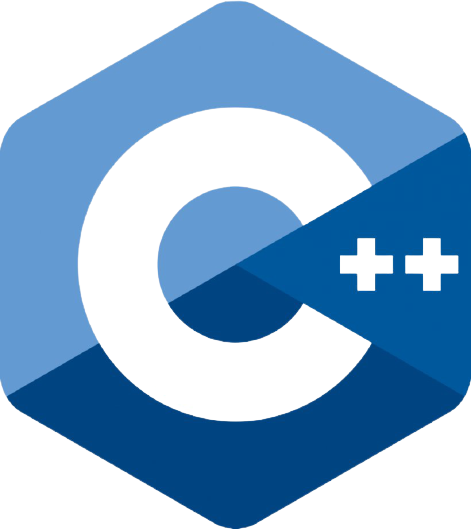

### Hi, I'm Mayur👋

#### I'm Developer, Self-Learner, Student.

- 🔭 I’m currently working on Asp Dotnet Core 3.1,Angular 8
- 💬 Ask me about programming.
- ⚡ LeetCode Profile : https://leetcode.com/mayur2402/
### Connect with me:

[][linkedin]
[][instagram]
[][twitter]

 

[linkedin]: https://www.linkedin.com/in/mayur-dimble-3b7a6895/
[instagram]: https://www.instagram.com/mayur.2402/
[twitter]: https://twitter.com/DimbleMayur

### Languages and tools

 
 
 

